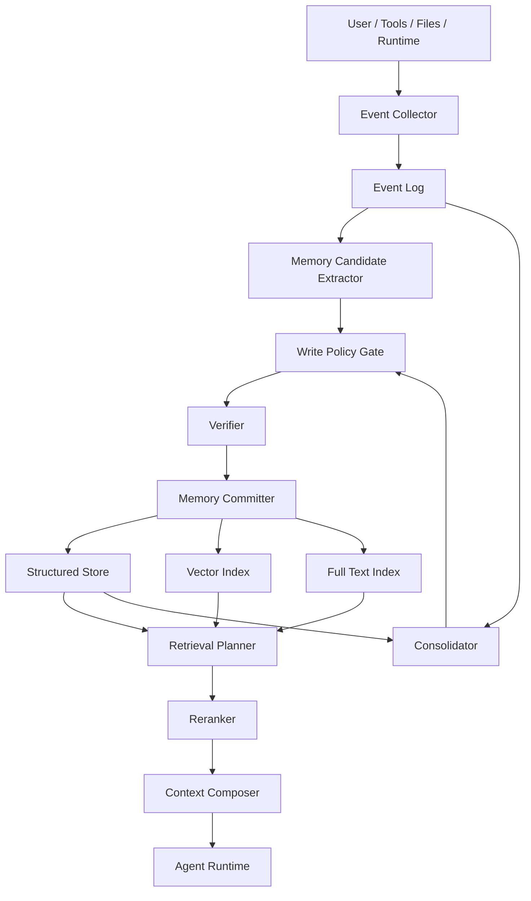

# 02. 系统架构

## 1. 总体架构

推荐采用事件驱动的记忆架构。



## 2. 模块说明

### 2.1 Event Collector

负责收集原始事件。

来源包括：

- 用户消息
- 智能体回复
- 工具调用
- 文件读取
- 命令输出
- 测试结果
- 用户确认或否定

Event Collector 不判断信息是否值得长期保存，只负责完整记录必要证据。

### 2.2 Event Log

Event Log 是系统的事实底座，建议使用 append-only 方式保存。

作用：

- 保留原始证据
- 支撑审计和回放
- 支撑未来重新总结
- 防止长期记忆丢失来源

Event Log 可以包含较多信息，但需要注意敏感信息过滤。

### 2.3 Memory Candidate Extractor

负责从 Event Log 中提取候选记忆。

它可以由规则、模型或混合方式实现。

候选记忆示例：

```json
{
  "content": "用户在记忆系统设计中偏好保守写入，避免记忆污染。",
  "type": "user_preference",
  "scope": "global",
  "source_event_ids": ["evt_001", "evt_002"],
  "reason": "用户多次明确强调宁可少记，不要污染记忆。"
}
```

### 2.4 Write Policy Gate

写入门禁是整个系统最重要的模块之一。

它负责判断候选记忆是否允许进入长期记忆库。

基本规则：

- 长期有用
- 明确真实
- 非敏感
- 未来大概率可复用
- 不与已有记忆重复
- 不与已有记忆冲突，或冲突已被处理

### 2.5 Verifier

Verifier 负责验证事实。

不同类型的记忆有不同验证方式：

| 记忆类型 | 验证方式 |
| --- | --- |
| 用户偏好 | 用户明确表达或多轮稳定行为 |
| 项目事实 | 读取源文件、配置文件、命令输出 |
| 工具规则 | 工具文档、实际调用结果 |
| 环境事实 | 命令检查、系统信息、路径存在性 |
| 排错经验 | 问题真实发生且解决方式已验证 |

### 2.6 Memory Committer

负责将通过门禁的候选记忆写入存储层。

提交时需要：

- 写入当前版本
- 记录来源事件
- 建立实体关系
- 更新全文索引
- 更新向量索引
- 记录审计日志

### 2.7 Structured Store

保存可解释、可过滤、可治理的结构化记忆。

适合使用：

- SQLite
- PostgreSQL
- MySQL

第一阶段建议 SQLite，后续再迁移到 PostgreSQL。

### 2.8 Vector Index

保存语义向量，用于相似经验召回。

适合保存：

- 历史排错摘要
- 长文档片段
- 经验总结
- 对话摘要

可选实现：

- pgvector
- Qdrant
- LanceDB
- Chroma
- sqlite-vec

### 2.9 Full Text Index

保存精确关键词检索能力。

它对以下内容非常重要：

- 文件路径
- 命令
- 错误码
- 函数名
- 配置项
- 端口号

可选实现：

- SQLite FTS5
- PostgreSQL full text search
- Elasticsearch
- Meilisearch

### 2.10 Retrieval Planner

负责根据当前任务决定检索什么。

例如：

- 用户问偏好：检索 `user_preference`
- 用户问项目事实：检索 `project_fact`
- 用户要排错：检索 `troubleshooting` 和 `environment_fact`
- 用户要执行任务：检索 `tool_rule` 和 `workflow`

### 2.11 Context Composer

负责把检索结果压缩成可注入上下文。

它需要控制：

- 内容长度
- 优先级
- 新旧程度
- 证据说明
- 冲突标记
- 是否需要重新验证

### 2.12 Consolidator

负责定期巩固记忆。

它可以做：

- 合并重复记忆
- 把多个事件总结成稳定经验
- 降权长期未使用记忆
- 标记可能过期的记忆
- 生成反思型记忆

## 3. 推荐运行模式

### 3.1 保守模式

默认模式。候选记忆需要人工确认或高置信规则才能写入。

适合早期系统。

### 3.2 半自动模式

系统可以自动写入低风险、高确定性的记忆，但对偏好、敏感信息、冲突内容仍需确认。

适合中期系统。

### 3.3 自动治理模式

系统可以自动写入、合并、降权、归档，并保留审计和回滚能力。

适合成熟系统。

## 4. Remote Adapter 层

远程能力不直接替代本地治理层，而是作为可替换的旁路能力：

```text
Event Log
  -> Local Rule Extractor
  -> Remote LLM Extractor
  -> Candidate Comparison
  -> Local Write Policy Gate
  -> Structured Store
```

当前实现中，远程 LLM 只能返回候选记忆，不能绕过本地 `evaluate_candidate`、人工确认、生命周期和审计记录。远程 embedding 也只负责返回向量，暂不直接写入索引。

这样设计的原因是：

- 远程模型可以提升提取质量，但不应该拥有最终写入权。
- 本地规则可以作为回归基线，方便比较远程结果是否漂移。
- API key、超时、失败率和模型版本都需要被隔离在 adapter 层。
- 后续接 OpenAI、私有模型或自建服务时，只需要替换 adapter，不需要重写记忆核心。
