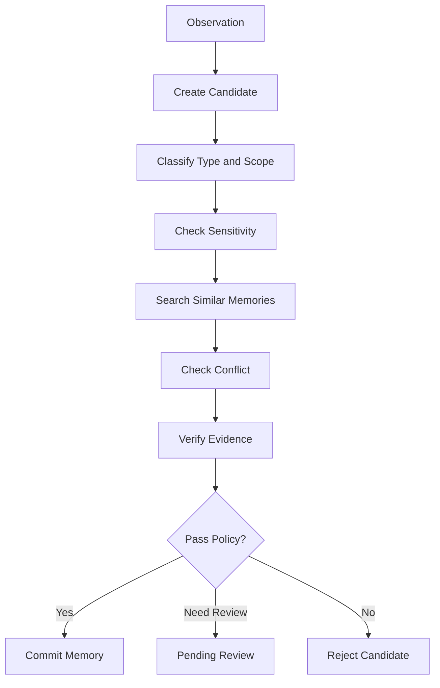

# 04. 写入治理

## 1. 为什么写入治理最重要

记忆系统最大的风险不是“忘记”，而是“错误地记住”。

错误记忆会导致：

- 智能体反复使用过期事实
- 把一次性请求当成长期偏好
- 把推测当成事实
- 把敏感信息长期保存
- 多个冲突版本同时生效

所以，写入治理应该位于所有长期记忆写入之前。

## 2. 自动写入条件

只有同时满足以下条件，才允许自动写入长期记忆：

```text
长期有用
明确真实
非敏感
未来大概率可复用
不与已有记忆重复
不与已有记忆冲突，或冲突已解决
```

如果任何条件不确定，默认不写入，或者进入候选池等待人工确认。

## 3. 写入流程



## 4. 候选记忆评估表

| 问题 | 通过标准 |
| --- | --- |
| 这条信息未来是否还会有用 | 会影响后续回答、工具使用或项目操作 |
| 它是否明确真实 | 用户明确说过，或工具/文件/命令验证过 |
| 它是否敏感 | 不包含密钥、隐私、账号、令牌等 |
| 它的范围是否清楚 | 能区分全局、用户、项目、仓库、任务 |
| 它是否和已有记忆重复 | 如果重复，应合并或忽略 |
| 它是否和已有记忆冲突 | 如果冲突，应修订而不是并存 |

## 5. 敏感信息策略

默认不写入：

- 密码
- API Key
- Token
- Cookie
- 私人身份信息
- 未授权的业务数据
- 一次性链接
- 明确要求不要保存的内容

可以写入经过脱敏的规则，例如：

```text
项目使用某云服务，但具体密钥不得保存。
```

## 6. 重复检测

写入前必须搜索相似记忆。

建议使用三种方式：

- 精确关键词检索
- 语义向量检索
- 同主题同范围过滤

处理方式：

| 情况 | 处理 |
| --- | --- |
| 内容完全相同 | 不写入 |
| 内容高度相似但更完整 | 更新原记忆 |
| 内容相似但范围不同 | 分别保存，明确 scope |
| 内容冲突 | 进入冲突处理 |

## 7. 冲突处理

冲突类型包括：

- 用户偏好改变
- 项目入口改变
- 工具规则改变
- 环境约束改变
- 旧排错经验不再适用

推荐策略：

```text
发现冲突
  -> 标记旧记忆为 stale 或 superseded
  -> 新建或更新当前记忆
  -> 保存版本历史
  -> 必要时请求用户确认
```

不要简单追加冲突记忆，否则检索时会出现多条互相矛盾的上下文。

## 8. 写入等级

### 8.1 Level 0：只记录事件

所有原始信息只进入 Event Log，不生成长期记忆。

适合刚开始开发。

### 8.2 Level 1：候选记忆

系统提取候选记忆，但必须人工确认。

适合早期测试写入质量。

### 8.3 Level 2：低风险自动写入

系统可以自动写入明确、低敏、低冲突风险的信息。

例如：

- 已验证的项目路径
- 已验证的启动命令
- 已验证的工具限制

### 8.4 Level 3：策略化自动写入

系统可以根据规则自动更新、合并、归档。

需要具备：

- 审计日志
- 版本回滚
- 冲突检测
- 敏感信息扫描
- 用户可查看和删除

## 9. 排错经验写入规则

排错经验只有在以下条件全部满足时才写入：

- 问题真实发生
- 原因已经明确或足够可靠
- 解决方式已经验证
- 未来可能复用
- 不包含敏感信息

统一模板：

```text
问题：
经验：
解决方式：
```

增强模板：

```text
问题：
触发条件：
排查过程：
经验：
解决方式：
证据：
适用范围：
不适用情况：
```

## 10. 候选记忆抽取提示词示例

```text
你是记忆候选提取器。

从输入事件中提取可能值得长期保存的信息。
只输出候选，不要直接写入。

每条候选必须包含：
- content
- type
- scope
- source
- reason
- confidence
- risk

不要提取：
- 一次性请求
- 临时状态
- 未验证猜测
- 敏感信息
- 已明显无复用价值的信息
```

## 11. 写入门禁提示词示例

```text
你是记忆写入门禁。

判断候选记忆是否允许写入长期记忆。

只有同时满足以下条件才允许写入：
1. 长期有用
2. 明确真实
3. 非敏感
4. 未来大概率可复用
5. 不与已有记忆重复
6. 不与已有记忆冲突，或冲突已解决

输出：
- decision: write | reject | ask_user | merge | update
- reason
- required_action
```

